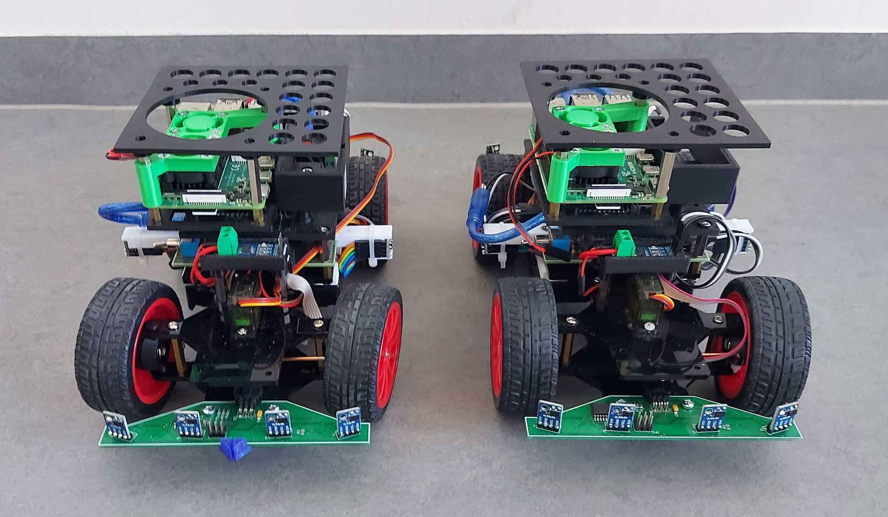

# Traffic Sign Recognition — Intel Neural Compute Stick 2

<p align="center">
  
</p>

<p align="center">
  
  
  
  
  
</p>

> **Course project** — NIE-EHW Embedded Hardware, [Czech Technical University in Prague](https://www.cvut.cz/en) (CTU), 2025
>
> Real-time traffic sign detection on the [LIVS](https://dcgi.fel.cvut.cz/home/cech/livs/) self-driving car platform using **YOLOv3-tiny**, **Intel Neural Compute Stick 2** and a **Raspberry Pi 4**.

---

## Table of Contents

- [Overview](#overview)
- [Architecture](#architecture)
- [Project Structure](#project-structure)
- [Getting Started](#getting-started)
  - [Training](#1-training-gpu-workstation)
  - [Model Export](#2-model-export-onnx--openvino-ir)
  - [Inference](#3-inference-raspberry-pi--ncs2)
- [Performance](#performance)
- [Important Notes](#important-notes)
- [Troubleshooting](#troubleshooting)
- [Authors](#authors)
- [License](#license)
- [References](#references)

---

## Overview

| | |
|---|---|
| **Model** | YOLOv3-tiny (custom *tinyu* variant, Ultralytics) |
| **Accuracy** | mAP50 **0.87** — Precision **0.95** — Recall **0.82** |
| **Inference** | ~180 ms on NCS2 (MYRIAD) — ~500 ms end-to-end |
| **Classes** | 15 — traffic lights, speed limits (10–120 km/h), stop sign |
| **Streaming** | Low-latency UDP + H.264 via FFmpeg |

---

## Architecture

```
USB Camera ──► Raspberry Pi 4 ──► Intel NCS 2      Arduino Nano
  320×240        Python 3.10       (MYRIAD plugin)  (vehicle control)
                      │
                      ▼  UDP / H.264
                  Client PC
                  (ffplay)
```

**Inference pipeline:**

```
Capture → Letterbox resize (352×352) → OpenVINO inference
       → Manual NMS post-processing → Annotation → H.264 encode → UDP stream
```

> The full YOLOv3-tiny post-processing (box decoding, NMS) is implemented manually
> because the OpenVINO 2022.3 legacy API does not expose it natively.

---

## Project Structure

```
.
├── src/
│   └── inference.py            # Inference + streaming script (Raspberry Pi)
├── notebooks/
│   └── training.ipynb          # Training notebook (Jupyter)
├── models/
│   ├── yolov3-tinyu.pt         # Pre-trained base weights
│   ├── best.onnx               # Fine-tuned model (ONNX)
│   └── openvino_ir/            # OpenVINO IR for NCS2 (.xml / .bin)
├── training_results/           # Metrics, curves and confusion matrices
├── dataset/                    # Dataset (not included — see below)
├── requirements/
│   ├── training.txt            # GPU workstation dependencies
│   └── inference.txt           # Raspberry Pi dependencies
└── docs/                       # Presentation (Reveal.js) and task report
```

---

## Getting Started

### 1. Training (GPU workstation)

```bash
python3.10 -m venv .venv && source .venv/bin/activate
pip install -r requirements/training.txt
```

Open `notebooks/training.ipynb`, set `path_to_repository`, and run all cells.

> **Dataset not included.** Download it from [Roboflow](https://universe.roboflow.com/selfdriving-car-qtywx/self-driving-cars-lfjou/dataset/6) and place it under `dataset/`.

---

### 2. Model Export (ONNX → OpenVINO IR)

```bash
mo --input_model models/best.onnx \
   --output_dir models/openvino_ir/ \
   --input_shape [1,3,352,352] \
   --data_type FP16
```

---

### 3. Inference (Raspberry Pi + NCS2)

```bash
python3.10 -m venv ov2022 && source ov2022/bin/activate
pip install -r requirements/inference.txt

# Verify NCS2 is detected
python -c "from openvino.inference_engine import IECore; print(IECore().available_devices)"
# Expected output: ['CPU', 'MYRIAD']

python src/inference.py
```

On the client PC, open the stream:

```bash
ffplay -fflags nobuffer -flags low_delay -framedrop udp://@:5001
```

---

## Performance

### Latency Breakdown

| Stage | Latency |
|---|---|
| Camera capture | ~30 ms |
| Preprocessing | ~15 ms |
| **Inference (NCS2)** | **~180 ms** |
| Post-processing + drawing | ~170 ms |
| H.264 encoding | ~40 ms |
| Network (UDP) + decoding | ~65 ms |
| **End-to-end** | **~500 ms** |

### Training Results (100 epochs)

| Metric | Value |
|---|---|
| mAP50 | 0.871 |
| mAP50-95 | 0.773 |
| Precision | 0.954 |
| Recall | 0.816 |

---

## Important Notes

- **Intel NCS2 was discontinued in 2022.** Only OpenVINO **2022.3** supports the MYRIAD plugin — newer versions will not work.
- USB udev rules may be required for NCS2 access on Linux — see [Troubleshooting](#troubleshooting).

---

## Troubleshooting

<details>
<summary><strong>NCS2 not detected</strong></summary>

```bash
# Check USB connection
lsusb | grep Movidius

# Install udev rules
sudo usermod -a -G users $USER
echo 'SUBSYSTEM=="usb", ATTRS{idVendor}=="03e7", MODE="0666"' \
  | sudo tee /etc/udev/rules.d/97-myriad.rules
sudo udevadm control --reload-rules && sudo udevadm trigger
```

Make sure you are using `openvino==2022.3.0`.
</details>

<details>
<summary><strong>Camera not opening</strong></summary>

```bash
ls /dev/video*     # verify device exists
ffplay /dev/video0 # test capture
sudo apt install v4l-utils
```
</details>

<details>
<summary><strong>H.264 encoder not found</strong></summary>

Replace `h264_v4l2m2m` with `libx264` in `src/inference.py` to fall back to software encoding.
</details>

---

## Authors

| Name | Contribution |
|---|:---:|
| **Tom Mafille** | 50% |
| **Lukas Prendky** | 50% |

---

## License

[MIT](LICENSE) — Dataset: [CC BY 4.0](https://creativecommons.org/licenses/by/4.0/)

---

## References

- [Ultralytics YOLO documentation](https://docs.ultralytics.com/)
- [OpenVINO 2022.3 documentation](https://docs.openvino.ai/2022.3/)
- [Self-driving Cars Dataset — Roboflow](https://universe.roboflow.com/selfdriving-car-qtywx/self-driving-cars-lfjou/dataset/6)
- [LIVS Platform — CTU Prague](https://dcgi.fel.cvut.cz/home/cech/livs/)
